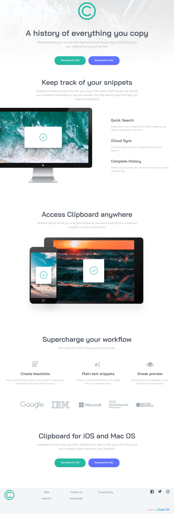
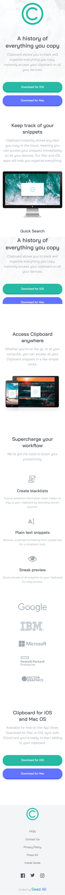

# Frontend Mentor - Clipboard landing page solution

This is a solution to the [Clipboard landing page challenge on Frontend Mentor](https://www.frontendmentor.io/challenges/clipboard-landing-page-Llp6M6r5).  
Frontend Mentor challenges help you improve your coding skills by building realistic, production-ready projects.

---

## 📋 Overview

### 🔹 The Challenge

Users should be able to:

- View the landing page layout optimized for different screen sizes  
- See hover states for all interactive elements  
- Experience a clean, readable, and accessible layout  
- Navigate a visually consistent and well-structured landing page  

---

### 🖼️ Screenshot

**Desktop View**  

**Mobile View**  

---

### 🔗 Links

- **Live Site URL:** https://clipboard-landing-page-fm-pi.vercel.app/

---

## 💡 My Process

### 🔧 Built With

- Semantic **HTML5 markup**
- **CSS custom properties** (variables)
- **Flexbox & CSS Grid** for layout
- **Mobile-first responsive design**
- Clean CSS reset for consistency
- Inline **SVG icons** styled using `currentColor`
- Accessible structure with meaningful class names

---

### 🧠 What I Learned

This project helped me strengthen my understanding of:

- Structuring a full landing page using **semantic HTML**
- Creating scalable layouts using **Flexbox and Grid**
- Managing colors and typography with **CSS variables**
- Building reusable UI components (buttons, feature cards)
- Styling **inline SVG icons** with hover effects using `currentColor`
- Writing clean, readable, and maintainable CSS
- Applying a mobile-first workflow with responsive breakpoints

---

## 📚 Useful Resources

- [**Kevin Powell – YouTube Channel**](https://www.youtube.com/@KevinPowell)  
  Helped reinforce modern CSS layout techniques and best practices.

- [**MDN Web Docs**](https://developer.mozilla.org/)  
  Used as a reference for HTML semantics, accessibility, and CSS properties.

---

👨‍💻 **Author**

- **Frontend Mentor:** [@Saad Ali](https://www.frontendmentor.io/profile/ByteSaad)  
- **GitHub:** [@ByteSaad](https://github.com/ByteSaad)

---

✨ Thanks for checking out my solution!  
Feedback and suggestions are always welcome 🙌
